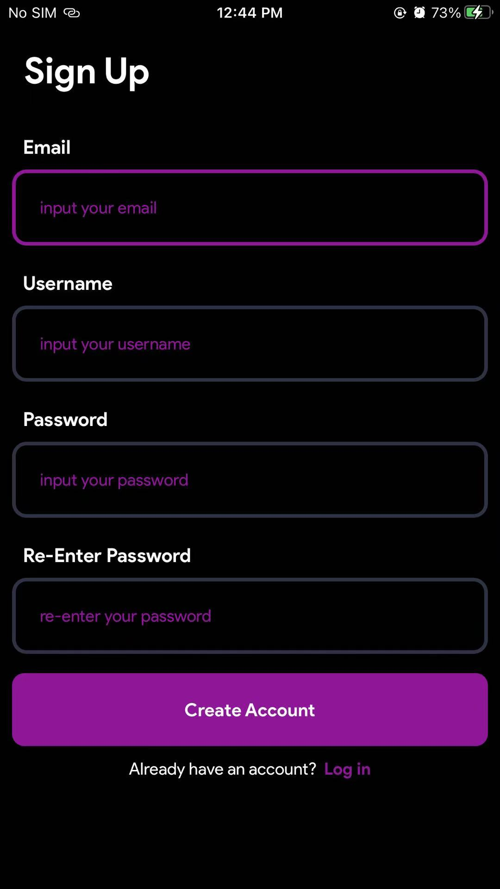
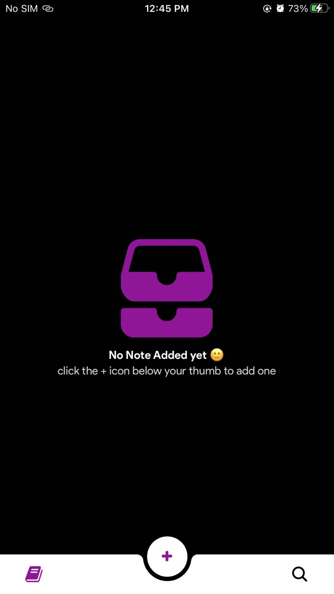
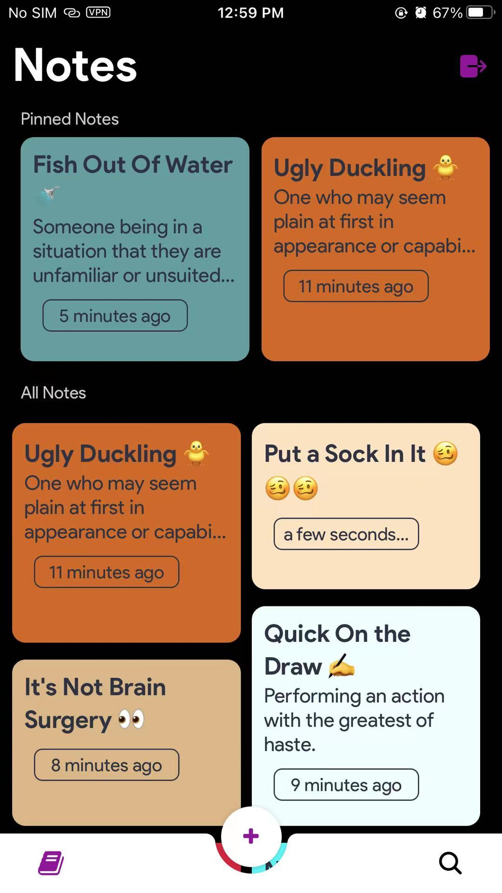
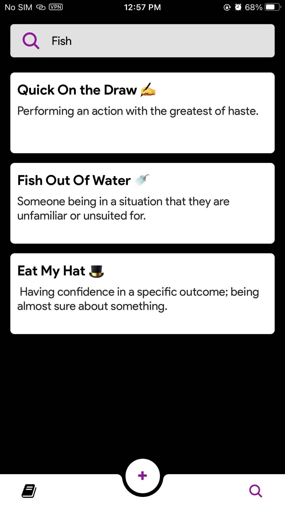

# SwiftNote
   

Mobile Frontend for Ktor Note Https Rest Api
 Made with react native with &#9829;

#Check out it's Rest Api [here](https://github.com/AbGhost-cyber/Swift-Ktor-Note-Rest-Api)

| 
|  
 
 
